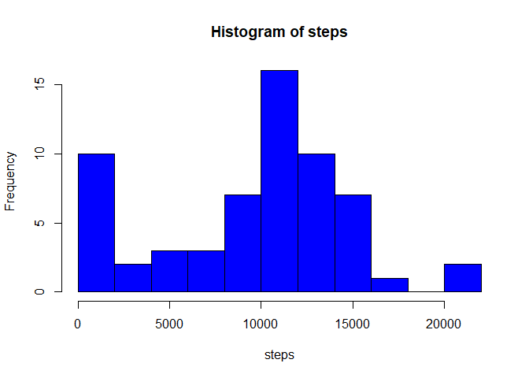
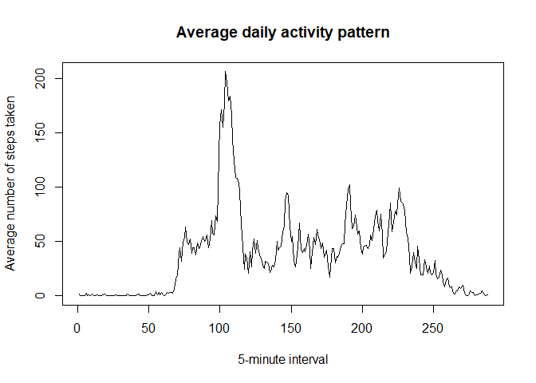
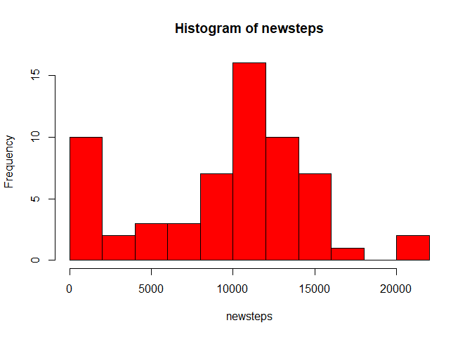
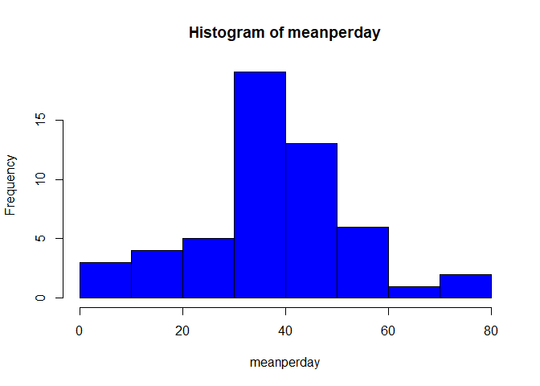
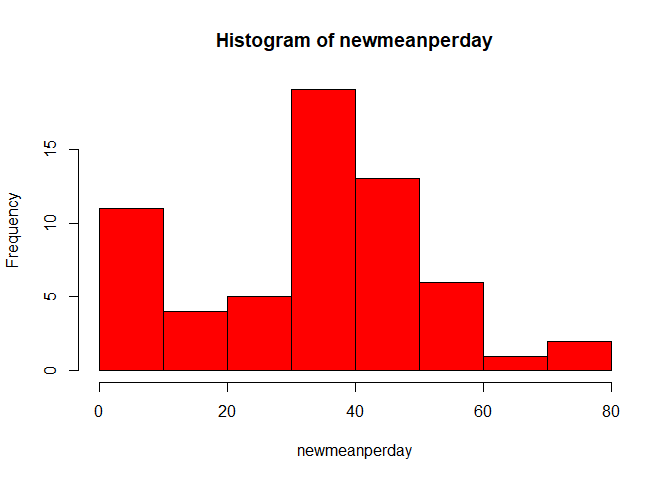
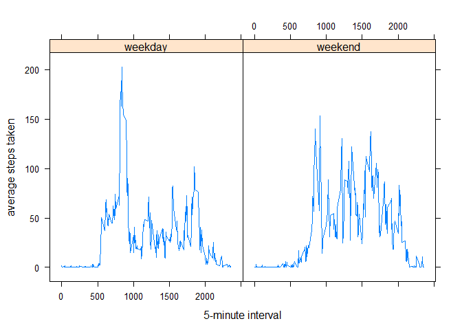

## Loading and preprocessing the data


```r
unzip("activity.zip")
activity <- read.csv(file = 'activity.csv')
```

## What is mean total number of steps taken per day?

Histogram of the steps taken each day


```r
steps <- tapply(activity$steps, activity$date, sum, na.rm = TRUE)
hist(steps, col="blue", breaks=10)
```

<!-- -->

Mean and median of the total number of steps taken per day


```r
meansteps <- mean(steps)
meadiansteps <- median(steps)
```

The mean is 9354.2295082 and the median is 10395

## What is the average daily activity pattern?

Average daily activity pattern


```r
interval <- tapply(activity$steps, activity$interval, mean, na.rm = TRUE)
plot(interval, type = "l", main="Average daily activity pattern",
     xlab = "5-minute interval", ylab = "Average number of steps taken")
```

<!-- -->

Which 5-minute interval, on average across all the days in the dataset, contains the maximum number of steps?


```r
asc <- interval[order(-interval)]
max <- asc[1]
```

The interval of 835 has 206.1698113 as the maximum value.

## Imputing missing values


```r
totalna <- sum(is.na(activity$steps))
```

The amount of missing values is 2304.

Filling in all of the missing values in the dataset


```r
medianactivity <- tapply(activity$steps, activity$interval, median, na.rm = TRUE)
newactivity <- activity
for (i in names(medianactivity)) {
    newactivity$steps <- replace(
                    newactivity$steps,
                    which(is.na(newactivity$steps)),
                    medianactivity[[i]])
}
```

Histogram of the total number of new steps taken each day


```r
newsteps <- tapply(newactivity$steps, newactivity$date, sum)
hist(newsteps, col="red", breaks=10)
```

<!-- -->

Mean and median of the total number of new steps taken per day


```r
meanperday <- tapply(activity$steps, activity$date, mean)
medianperday <- tapply(activity$steps, activity$date, median)
newmeanperday <- tapply(newactivity$steps, newactivity$date, mean)
newmedianperday <- tapply(newactivity$steps, newactivity$date, median)
```

Histogram of means 


```r
hist(meanperday, col="blue", breaks = 10)
```

<!-- -->


```r
hist(newmeanperday, col="red", breaks = 10)
```

<!-- -->

The new values differ from the estimates from the first part of the report. We see an increase in the interval near zero thanks to the missing values replaced.

## Are there differences in activity patterns between weekdays and weekends?

Creating a new factor variable in the dataset with two levels – “weekday” and “weekend” indicating whether a given date is a weekday or weekend day.


```r
newactivity$week <- "weekday"
for (i in 1:length(newactivity$steps)){
  if(weekdays(as.Date(newactivity$date[i], "%Y-%m-%d"))=="sábado" |
     weekdays(as.Date(newactivity$date[i], "%Y-%m-%d"))=="domingo"){
    newactivity$week[i] <- "weekend"
  }
}
newactivity$week <- as.factor(newactivity$week)
```

Panel plot containing a time series plot of the 5-minute interval and the average number of steps taken, averaged across all weekday days or weekend days.


```r
library(lattice)
aggr <- aggregate(steps ~ interval + week, newactivity, mean)
xyplot(steps ~ interval | week, data = aggr, type = "l", 
       xlab = "5-minute interval", 
       ylab = "average steps taken")
```

<!-- -->
